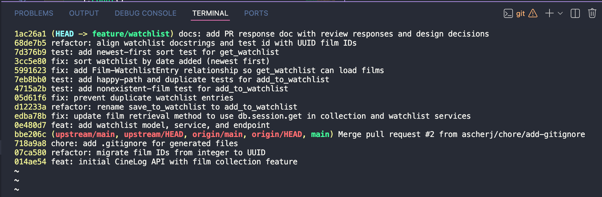

# PR Response Doc — CineLog Watchlist Feature

## AI Usage
I used Claude Code as a devil's advocate on the two design decisions (Comments 4 and 5), following the workflow the project suggests: I wrote my own position first, then asked it "what counterargument would a careful reviewer raise, and what tradeoff am I not acknowledging?" I also used it for mechanical work — running the test suite in `.venv`, making commits, and transcribing my reasoning into this doc. It did not write my positions; the decisions and core reasoning are mine.

**Technical & mechanical work.** Beyond stress-testing the two arguments, I used Claude Code to carry out most of the hands-on execution while I directed the work, made the decisions, and reviewed each step: orienting in the codebase and mirroring the existing collection pattern; running `pytest` in the `.venv` after each change; making the conventional-commit commits; performing the rebase onto `main` and resolving the int→UUID conflict; rewriting the commit history (rewording the base commit, and moving the `WatchlistEntry` model into the `feat` commit so the dedup commit stayed a single logical change); checking the final `git log` against the Conventional Commits spec and flagging a commit that bundled two changes, which I then had it split; verifying the feature end-to-end through the route layer; and drafting the factual write-ups (Comment 6 and the PR description). I confirmed each result myself — tests green, no merge commits, and the final tree byte-identical to before the history rewrite.

**Comment 4 (default visibility):** I wrote the case for keeping `public=True`. The stress-test pointed out I was only arguing *against* a private default rather than acknowledging the real cost of *my own* choice, so I added the tradeoff — that a user could disclose their intent by mistake if they don't realize the default is public — plus a note that the per-entry `public` flag makes this opt-out rather than locked open. That mitigation line was AI-suggested; I kept it because it's true of the schema and sets up my stretch feature.

**Comment 5 (sort order):** I drafted my own argument for `date_added` because it "tells a story." The stress-test surfaced three real gaps and I revised: (1) my "understand your tastes over time" reasoning was actually a *collection* argument, since a watchlist is forward-looking intent — I re-aimed it to the watchlist (what caught my eye and when / evolving curiosity); (2) my rationale implied chronological order but a "feed" is newest-first, so I committed to newest-first; (3) I hadn't engaged the reviewer's strongest implicit reason — consistency with the collection's existing newest-first `date_added` sort — so I added it, and I sharpened my tradeoff from "seems unorganized" to the real findability cost. The consistency point and the findability framing originated in the stress-test; I adopted them because I agree with them.

## Comment 1 — Rename
**What I did:** Renamed `save_to_watchlist()` → `add_to_watchlist()` in `services/watchlist_service.py` to follow the project's `verb_to_noun` convention and mirror `add_to_collection()`. Updated both references in `routes/watchlist/watchlist.py` (the import on line 8 and the call site on line 32) and the function's docstring verb ("Save" → "Add") so the operation stays internally consistent. Committed as one logical change (`refactor:`).
**How I verified:** Ran a project-wide `grep` for `save_to_watchlist` before and after — the only remaining hits are in planning docs, not code. `pytest tests/` passes 8/8.

## Comment 2 — Deduplication
**What I did:** Mirrored the collection deduplication pattern in `add_to_collection()` across four spots: (1) defined `AlreadyInWatchlistError` in `services/watchlist_service.py`; (2) added a service-level check in `add_to_watchlist()` that queries `WatchlistEntry` by `(user_id, film_id)` and `.first()`, raising `AlreadyInWatchlistError` if a row already exists — placed *after* the film-exists check and *before* the insert, so a duplicate raises instead of creating a second row; (3) added a DB-level `UniqueConstraint("user_id", "film_id", name="unique_user_film_watchlist")` on `WatchlistEntry` as a backstop (same belt-and-suspenders approach as `CollectionEntry`); (4) updated the add route to catch the errors and return `409` (duplicate) / `404` (missing film), matching `routes/collection.py`.
**How I verified:** I read `add_to_collection()` first to confirm what the check does — it queries for an existing entry and **raises** on a duplicate (it does not return the existing entry), so control never reaches the insert. I mirrored that behavior, not the code. To prove it actually works (not just by analogy to collection), `tests/test_watchlist.py::test_add_to_watchlist_duplicate_raises` adds the same film twice and asserts (a) the second call raises `AlreadyInWatchlistError` and (b) only one row exists in the DB afterward. Full suite: `pytest tests/ -v` → 8/8 pass (run inside `.venv`).

## Comment 3 — Missing test
**What I did:** Created `tests/test_watchlist.py`, reusing the fixture structure from `tests/test_collection.py` (`app`, `sample_user`, `sample_film` — the in-memory SQLite setup). Modeled the test on `test_add_to_collection_nonexistent_film_raises`: `test_add_to_watchlist_nonexistent_film_raises` asserts that calling `add_to_watchlist()` with a film_id that isn't in the DB raises `FilmNotFoundError` (via `pytest.raises`), rather than failing some other way. One note on the test's fake id: I originally used a nonexistent **integer** (`999999`) because this branch predated the UUID migration; after the Comment 6 rebase onto `main` I updated it to a nonexistent **UUID string**, matching `test_collection.py`, so it's consistent with the migrated schema.
**How I verified:** Ran `pytest tests/test_watchlist.py -v` and `pytest tests/ -v` (inside `.venv`). Beyond the required nonexistent-film test, I added happy-path and duplicate tests so `add_to_watchlist` now has the full happy/duplicate/nonexistent trio that CONTRIBUTING.md requires for every new service function. Whole suite is 8/8 green.

## Comment 4 — Default visibility
**My position:** Keep `public=True` as the default for watchlist entries.

**Reasoning:** We want public to be the default position of the app because we're optimizing for community discovery. CineLog is a community film-tracking app — engaging with it means you want to share. If everyone kept their watchlist private and had to opt in to share, the app would have a much harder time growing; a public default lets us piggyback on our users' curiosity about what other people are planning to watch. It's also in line with apps people are already used to, where things are public by default and you choose to make them private. Ultimately, if all you wanted was to privately track films you mean to watch, you could just use a notes app on your phone — the reason to be on CineLog is to share, so the default should reflect that.

**Tradeoff acknowledged:** The risk of defaulting to public is that if a user doesn't realize public is the default, they could disclose their intent — the films they're planning to watch — by mistake, without realizing it. That's the real cost of making public the default. What bounds that cost is that visibility is a per-entry `public` flag on `WatchlistEntry`, so the default is opt-out rather than locked open — the schema already supports making any individual entry private. Exposing that choice at the point of adding a film (a `public` parameter on the add endpoint) is the natural next step, which is why I picked it up as a stretch feature.

## Comment 5 — Sort order
**My position:** Sort the watchlist by date added, newest first (implementing the maintainer's preference).

**Reasoning:** Date added gives you a record you wouldn't have if the list were alphabetical — it shows what caught your eye and when: what you got excited about recently versus what's been sitting on your list unwatched. That plays nicely with the curiosity that's the whole point of a CineLog. Alphabetical is really generic; date added tells more of a story. Sorting newest-first also keeps the watchlist consistent with the collection, which already sorts newest-first by date added, so the whole app follows one predictable rule instead of two. And picking date added as the default doesn't lock anything out — alphabetical can always be added later as another sort option.

**Engagement with reviewer's point:** I agree with the maintainer's `date_added` preference, and "like a feed" is right — newest-first is a feed. The tradeoff I'd own is that if you're looking for the list alphabetically it won't be, and if you didn't realize it's sorted by date added it might seem unorganized; the real cost is that in a long watchlist you can't quickly scan to a title you're looking for. That's why I'd keep alphabetical available as a secondary sort rather than the default.

## Comment 6 — Rebase
**What conflicted:** I rebased `feature/watchlist` onto `origin/main`, which carries the int→UUID migration (`07ca580`). `main` has no watchlist code at all, so most of my commits replayed cleanly. There was one content conflict, in `models.py`: the incoming `WatchlistEntry` model still declared `film_id = db.Integer` against a now-UUID `film.id`, and git couldn't cleanly place the class because `CollectionEntry`'s surrounding lines had changed in the UUID migration. (Before rebasing I also removed my untracked `.gitignore` so it wouldn't collide with `main`'s tracked one, which is a superset — I now inherit `main`'s version.)

**How I resolved it:** I kept the incoming `WatchlistEntry` class but changed `film_id` from `db.Integer` to `db.String(36), db.ForeignKey("film.id")`, matching `CollectionEntry` under the UUID scheme. Staged `models.py` and continued the rebase; the remaining commits (the `Film.watchlist_entries` relationship and the `date_added` sort) replayed cleanly. Because `main` never had watchlist code, the rebase left a few integer-era references untouched (git didn't flag them — they were new lines): the `add_to_watchlist` / route docstrings and the nonexistent-film test's fake id. I updated those to UUIDs in a follow-up `refactor:` commit (docstrings `film_id (int)` → UUID string; test `999999` → a UUID string like `test_collection.py`).

**How I verified no conflict remains:** (1) grep for conflict markers (`<<<<<<<` / `=======` / `>>>>>>>`) across `models.py`, `services/`, `routes/`, `tests/` → none. (2) `git log --merges origin/main..HEAD` is empty → no merge commits in my branch. (3) `git merge-base --is-ancestor origin/main HEAD` succeeds → `origin/main` is an ancestor of HEAD, confirming a linear rebase rather than a merge. (4) `pytest tests/` → 8/8 green in `.venv`, including the `get_watchlist` tests that exercise the UUID `film_id` end to end.

## Commit History

Screenshot of the final rewritten history (`git log --oneline`) — every commit conventional (`feat`/`fix`/`test`/`refactor`/`docs`), one logical change each, no merge commits:



Text version of the feature commits (`origin/main..HEAD`):

```text
docs: add PR response doc with review responses and design decisions
refactor: align watchlist docstrings and test id with UUID film IDs
test: add newest-first sort test for get_watchlist
fix: sort watchlist by date added (newest first)
fix: add Film-WatchlistEntry relationship so get_watchlist can load films
test: add happy-path and duplicate tests for add_to_watchlist
test: add nonexistent-film test for add_to_watchlist
fix: prevent duplicate watchlist entries
refactor: rename save_to_watchlist to add_to_watchlist
fix: update film retrieval method to use db.session.get in collection and watchlist services
feat: add watchlist model, service, and endpoint
```

## PR Description

### What this feature does
Adds a **watchlist** to CineLog — the films a user *intends* to watch, distinct from the collection (films they've already watched and rated). Included:
- **`WatchlistEntry` model** — links a user to a film with `date_added` and a `public` visibility flag; a `UniqueConstraint(user_id, film_id)` blocks duplicates at the DB level.
- **`services/watchlist_service.py`** — `add_to_watchlist(user_id, film_id)` (raises `FilmNotFoundError` for an unknown film, `AlreadyInWatchlistError` for a duplicate) and `get_watchlist(user_id)` (returns the films, newest first).
- **Routes** — `POST /watchlist/<user_id>/add` (`201` created, `404` unknown film, `409` duplicate) and `GET /watchlist/<user_id>`.

It mirrors the existing collection feature's structure, its `verb_to_noun` naming, and its belt-and-suspenders dedup (service-level check + DB constraint).

### Design decisions (full reasoning in the Comment 4 & 5 sections above)
- **Default visibility = public** (Comment 4): new watchlist entries default to `public=True` to optimize for community discovery. The flag is per-entry, so visibility is opt-out rather than locked open.
- **Sort by date added, newest first** (Comment 5): `get_watchlist` orders by `date_added desc`, matching the collection's ordering so the whole app follows one predictable rule. This implements the maintainer's preference over the original alphabetical sort.

### How to manually test end-to-end
1. **Install & run** (from the repo root, in the virtualenv):
   ```bash
   pip install -r requirements.txt
   python app.py            # serves http://localhost:5000, creates cinelog.db
   ```
2. **Seed a user and a film** (films are seeded data — there's no creation endpoint — so use a shell). In a second terminal at the repo root:
   ```bash
   PYTHONPATH=. python - <<'PY'
   from app import create_app, db
   from models import User, Film
   app = create_app()
   with app.app_context():
       u = User(username="ada", email="ada@example.com")
       f = Film(title="Paddington 2", year=2017, genre="Comedy")
       db.session.add_all([u, f]); db.session.commit()
       print("user_id:", u.id, "\nfilm_id:", f.id)
   PY
   ```
3. **Add to watchlist** → expect `201` and `"public": true`:
   ```bash
   curl -X POST localhost:5000/watchlist/<user_id>/add \
        -H "Content-Type: application/json" -d '{"film_id": "<film_id>"}'
   ```
4. **View watchlist** → expect the film with `date_added` and `public: true` (newest first):
   ```bash
   curl localhost:5000/watchlist/<user_id>
   ```
5. **Duplicate add** (repeat step 3) → expect `409` `AlreadyInWatchlistError`.
6. **Unknown film** → expect `404` `FilmNotFoundError`:
   ```bash
   curl -X POST localhost:5000/watchlist/<user_id>/add \
        -H "Content-Type: application/json" -d '{"film_id": "00000000-0000-0000-0000-000000000000"}'
   ```

I verified this exact flow through the route layer (`201` / `200` / `409` / `404`, all as expected). Automated coverage: `pytest tests/` → **8/8** — happy / duplicate / nonexistent for `add_to_watchlist`, plus newest-first ordering for `get_watchlist`.
